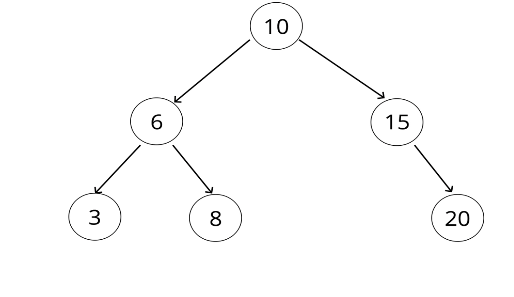
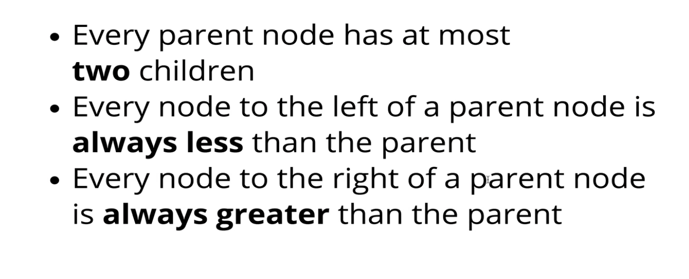

# Binary Search Trees

[See Wikipedia](https://en.wikipedia.org/wiki/Binary_search_tree)
[similar code](https://www.geeksforgeeks.org/implementation-binary-search-tree-javascript/)



- A special type of tree where each parent node contains at-most two children nodes that maintain an ordering of all left children being less than any given parent and all right children being greater than a given parent.
- Any data can be ordered in this paradigm but we will be building this data structure using integers to represent this structure

#### Reiterate -



#### Time Complexities


- Like binary search, since the tree is ordered with the same properties, searchng insertion and deletion actually also have the same time complexity as the divide and conquer approach workss on a sorted collection
- Each item we compare / process will cut the tree search space in half since we have a strict ordering paradigm in the BST. This 'cut-in-half' at a lower level is the mathematical defintion of Logarithms which is why the time complexity is LogN where the number of comparisons to get some piece of data is roughly Log of N where N is the amount of nodes in the tree (e.g Log (8) === 3 <= 3 comparisons)

### The 3 powerful DFS algorithms

- Can be used for printing, returning, comparing to a search key, etc.
- See code in the index.js file

##### In Order Traversal

```text

  /*
   * If the current node (starting from root) is not null,
   *    traverse down left
   *    Process this node (in our case, print it out)
   *    traverse down right
   * else, do nothing
   *
   */
```

##### Pre Order Traversal

```text

  /*
   * If the current node (starting from root) is not null,
   *    Process this node (in our case, print it out)
   *    traverse down left
   *    traverse down right
   * else, do nothing
   *
   */
```

##### Post Order Traversal

```text

  /*
   * If the current node (starting from root) is not null,
   *    traverse down left
   *    traverse down right
   *    Process this node (in our case, print it out)
   * else, do nothing
   *
   */
```

<br>

##### Sources

- All diagrams in this readme are sourced from Colt Steeles Data Structures masterclass [here](https://www.udemy.com/course/js-algorithms-and-data-structures-masterclass/)

- or from Wikipedia
