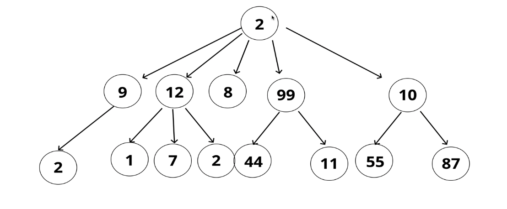

# Trees

### What are trees ?

- A tree is a data structure that consists of nodes which maintain a parent / child relationship such that each node can be a parent to at most two children nodes, which can then themselves be parents, etc.
- This establishes a recursive relationship

- Notice in the image, each node can have 0, 1 or at most, 2 nodes branched off of it

- Because of this structure, we can see the structure is not linear. The paths to any node K can be many ways. In a linear structure like a linked list, there is only one linear path however in a tree, there can be 0, 1 or more

### Tree terminology

- Root: The root (top) level node in the tree
- Child: A directly connected descendant of some node in the tree from root downwards
- Parent: The node in which contains links to children
- Sibling: Clusters of nodes with the same parent
- Leaf: A node with no children
- Edge: The links (connections) between any two nodes

### Uses for a tree

- The DOM on the web
- Establishing family trees / hierarchical structure to data
- Network routing
- Parsers - establishing syntax of a language and how the language is parsed in its environment to determine correct login / syntax mixed with semantics
- Many more applications!

### Types of trees

- Binary Trees [see code and repo here](https://github.com/TannerBarcelos/Data-Structures-and-Algorithms/tree/main/Trees/BST)
- BST (Binary Search Tree)
- Trie
- Unary Tree
- N-ary tree
- Heaps
- Many, many others : see [here](https://en.wikipedia.org/wiki/List_of_data_structures)
